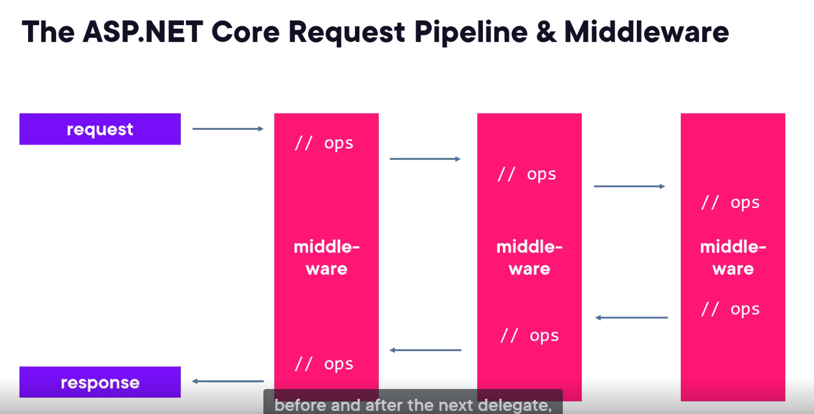

# what is asp.net core?
- cross-platform, open-source framework for building modern, cloud-enabled internet-connected applications

# History
When looking at .NET you have 2 different runtimes: .NET framework and .NET core (now just called .NET). .NET framework is relatively old and wil not be getting any new features, so you should focus on .NET core.
Within these runtimes we have the following technologies
    • .NET Framework (Windows only, legacy)
        ○ ASP.NET
            § WEB API
            § MVC
            § Webforms
        ○ Entity framework
    • .NET Core (Cross platform, newer)
        ○ ASP.NET Core
            § Web API
            § MVC
            § Minimal API's
            § Blazor
        ○ Entity framework core
A runtime is the software layer that executes your code. It provides the environment where your program runs, manages memory, handles exceptions, performs garbage collection, and more.

##### there are two ways for building web apis:
1) MVC - contoller based
2) minimal apis

###### launchSettings.json --> setting up environment for local machine development. Only for local dev. It is not deployed and it contains profile settings(different ways the app may start ex: kestral server(http/https), IIS Express)

We can also run the project from .net cli using **dotnet run**

request pipeline - middleware(software components to handle request and responses)
