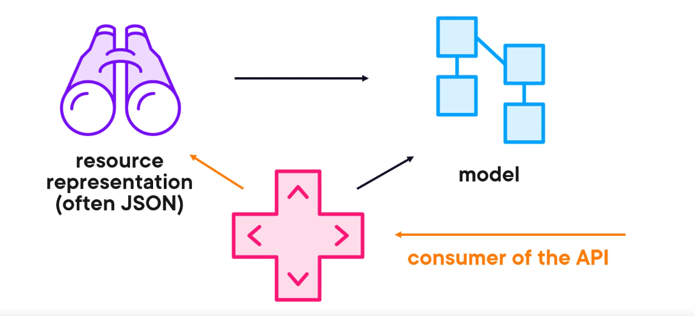

MVC
- Model View Controller
- architectural software pattern used to build applications
- used by many frameworks/languages
- in asp.net core it can be used to build full web apps
- It is not a full application layer architecture, used in presentation layer/service layer
- Model: contains application data
- View: handles the visual presentation of the data
- Controller: enables accepting user data and translates it to model data so the view can work with, it helps view component on what to display using model component if required

Benefits of using MVC
- allows loose coupling
- improves testability
- promotes reuse

The controller takes in the api request sends to business logic handling part, returns data for the view component to view it

 
Registering api services on container
builder.Services.AddMvc(adds services related to views too)/AddControllers 
