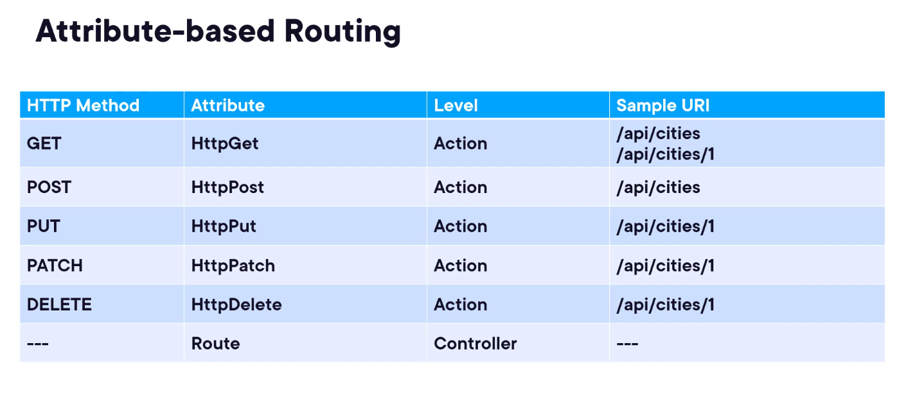

deriving ControllerBase class:why?
    - it provides helper methods and return types helpful while building apis
    - we can also derive only Controller class, it has extensive helper methods and best useful when we are dealing with views
attribute on top of the Controller class - [ApiController]
    - used to enable automatic behaviors and conventions that simplify the development of HTTP APIs. It provides features like implicit model state validation, attribute routing requirement, and default response formatting
routing
    - it maps request uri with action method in controller
    - or endpoint routing in asp.net core
    - to enable routing in asp.net core - we need to add two middlewares in request pipeline 
    i.e app.UseRouting() - selects which endpoint to execute
    app.UseEndpoints(endpoints => {
        endpoints.MapControllers();
    }) - the selected endpoint is executed
    shortcut --> app.MapControllers()
    - Routing can be done in two ways: Convention based , Attribute based
    - Attribute based: at the controller level and action level --> which will map to the uri
    - 
    - [Route("/api")] attribute is used at controller level, provides a template that will prefix all the templates at action level
postman demo
    - environment variables usage(portNumber)
How is entity different from Dto?
    - **What is returned or accepted by an api is not the same used by underlying data store**
    - to map to underlying datastore we use entity
Here, we use in memory static datastore(hard coded one)

Importance of statuc codes
    - consumer of api should know what is the response of the request 
    - There are 5 levels of status code
    1) Level 100 Informational - mostly not used by apis
    2) level 200 Success:
        - 200 OK
        - 201 Created - when a resource is successfully created
        - 204 No Content - succssful request that doesnt need to return anyrthing(like a delete request)
    3) Level 300 redirection - something has moved to some other location
    4) Level 400 Client errors
        - 400 Bad request - client provided irrelevate data for the request
        - 401 Unauthorized - the user is not authenticated to use resource
        - 403 Forbidden - authentication is done but user is not authorised to perform the action
        - 404 Not Found - the requested resource is not found
    5) Level 500 server errors
        - 500 Internal server error